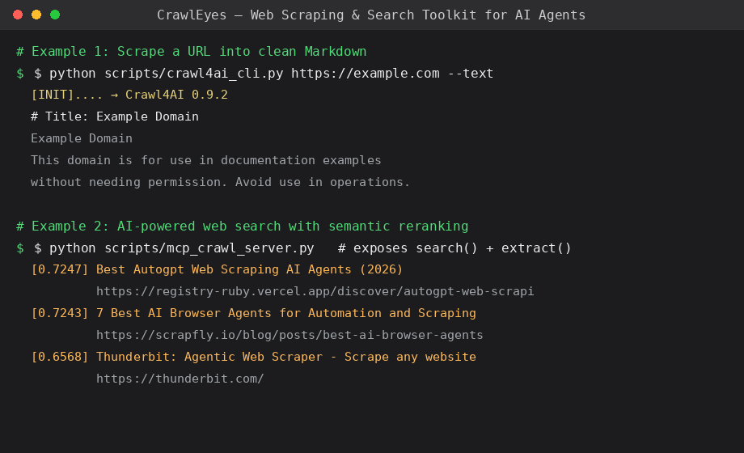

# CrawlEyes — Web Scraping & Search Toolkit for AI Agents

<!-- MCP Registry metadata: associates this PyPI package with the MCP registry entry.
     Name must match the mcpName in the registry listing. -->
<!-- mcp-name: io.github.waiky-github/CrawlEyes -->

[](https://github.com/waiky-github/CrawlEyes/stargazers)
[](https://github.com/waiky-github/CrawlEyes/blob/main/LICENSE)
[](https://www.python.org/)
[](https://modelcontextprotocol.io)
[](LICENSE)

**CrawlEyes** gives AI agents reliable **full-text extraction** (`web_extract`) and **robust search** (`web_search`) backends — the "eyes" that let agents see and read the web. Built and tested against [Hermes Agent](https://hermes-agent.nousresearch.com/docs).

Also ships as a **standard MCP server**, so any MCP client (Claude Desktop, Cursor, other agents) can reuse the same search + extraction capabilities.



## Why CrawlEyes?

Most agent toolkits cover *one* slice of the pipeline. CrawlEyes is the rare **all-in-one** that you can actually run behind the Great Firewall without external accounts.

| | Typical agent toolkit | **CrawlEyes** |
|:--|:--|:--|
| 🔍 **Search** | API key required, often blocked in CN | ✅ SearXNG (self-hosted) + **Tavily keyless fallback** — zero config, zero key |
| 📄 **Extraction** | Separate scraper, or Firecrawl SaaS | ✅ Built-in Crawl4AI full-text extract, ~89% noise removal |
| 🧠 **Semantic rerank** | Rarely included | ✅ Local fastembed rerank — no torch, ~50MB model |
| 🔌 **MCP server** | Often missing | ✅ Standard MCP tools (`search` + `extract` + `deep_research` + `sitemap`), any client |
| 🌐 **China-friendly** | Mostly English/GFW-blocked | ✅ Tested on a real mainland China server (baidu + yandex) |

> **Zero API keys. Zero external accounts. One command.** CrawlEyes is the only toolkit in this space that combines search + extraction + semantic reranking + MCP in a single, China-friendly, self-hosted package.

## Features

| Capability | Where | Why it matters |
|:--|:--|:--|
| **Full-text extraction** | `scripts/crawl4ai_cli.py` | Headless-browser scraping → clean Markdown; handles ~80% of JS/dynamic/UA-blocked pages |
| **Content denoising** (P1) | `crawl4ai_cli.py --noise-filter` | Prunes nav/ads/comments via Crawl4AI's `PruningContentFilter` — measured **24.6k→2.8k chars (~89% noise removed)** on a typical article |
| **Retry with backoff** (P3) | `crawl4ai_cli.py --retry N` | Exponential backoff (1s/2s/4s) on transient failures |
| **Browser session reuse** (P4) | `crawl4ai_cli.py --session NAME` | Reuses the browser context across scrapes in one process — no cold-start per URL |
| **Keyword-focused extraction** | `crawl4ai_cli.py --bm25 KEYWORD` | Keeps only paragraphs relevant to a keyword (experimental — BM25 is English-centric; works best on English docs) |
| **Search (primary)** | SearXNG (self-hosted meta-search) | Privacy-friendly search aggregator |
| **Search (fallback)** | Tavily keyless API | Zero-config, no-key fallback when SearXNG is down/empty |
| **Search orchestration** | `plugins/searxng-tavily/` | Hermes plugin provider: SearXNG first → auto-fallback to Tavily keyless; three-state circuit breaker (3 fails → 60s cooldown → half-open) + shared SQLite cache (TTL 3600s) |
| **Semantic reranking** (P2) | `scripts/crawl_search_standalone.py` | Local embedding rerank of search results with `fastembed` + `BAAI/bge-small-zh-v1.5` (512-dim, **no torch dependency**, ~50MB, cached) — puts relevant results first. Measured: crawler-relevant items 0.817/0.732 float to top, irrelevant 0.302/0.139 sink |
| **MCP server** (P5) | `scripts/mcp_crawl_server.py` | Exposes `search` + `extract` + `deep_research` + `sitemap` as standard MCP tools (**stdio default, or streamable-http** for remote clients). Works in *any* MCP client, no Hermes dependency. Extracted content is sanitized against prompt-injection (strips invisible chars + prompt-hijack lines). **Unified rate limiting + exponential backoff** guard every tool (sliding window, per-tool cost) so concurrent agent calls can't hammer downstream services |
| **Sitemap discovery** (P1) | `crawleyes/sitemap.py` | `sitemap(origin)` → parses `sitemap.xml` (plain / gzip / index-recursion) with `robots.txt` fallback, returns a deduped URL map. Zero-key way to discover a site's URL surface for whole-site fetch or deep-research seeding |
| **Multi-format extract** (P0) | `extract(..., format=)` | `markdown` (default) / `fit` (denoised) / `raw` (unfiltered) / `markdown_with_citations` — pick the level of cleanup you need |
| **RAG-ready interfaces** | `crawleyes/rag.py` | One-liners `markdown(url)` / `search_markdown(query)` → clean, sanitized, LLM-ready Markdown for RAG corpora |
| **Deep research** | `crawleyes/deep_research.py` | `deep_research(topic)` → decomposes topic into sub-questions → searches → extracts → synthesizes a **cited Markdown report**. Optional LLM (any OpenAI-compatible endpoint); degrades to evidence-aggregate mode without one |
| **Verification** | `scripts/` | Clean subprocess scripts to verify each backend end-to-end per Hermes profile |

## Project layout

```
plugins/searxng-tavily/   Hermes web-search provider plugin (SearXNG → Tavily keyless fallback)
                          + three-state circuit breaker + shared SQLite cache
scripts/
  crawl4ai_cli.py          Universal scraping CLI (URL → Markdown), with denoise/retry/session/BM25
  crawl_search_standalone.py  Standalone search (SearXNG → Tavily) + optional semantic rerank.
                             No Hermes dependency — usable anywhere, powers the MCP server.
  mcp_crawl_server.py      Standard MCP server exposing search + extract + deep_research + sitemap (stdio)
  single_env_check.py      Verify crawl4ai provider registered+available+extracts (one profile)
  verify_searxng_tavily.py Verify searxng-tavily provider: normal path + forced fallback
  agent_link_check.py      Verify full agent tool chain: web_search_tool dispatch + logs
```

## Quick start

### 1. Install Crawl4AI (China-friendly mirrors)

```bash
python3 -m venv .venv
# Use Tsinghua PyPI mirror for speed (or any mirror you prefer)
.venv/bin/pip install -i https://pypi.tuna.tsinghua.edu.cn/simple crawl4ai
# Playwright browser kernel — use npmmirror binary mirror if cdn.playwright.dev is blocked
PLAYWRIGHT_DOWNLOAD_HOST=https://registry.npmmirror.com/-/binary/playwright \
  .venv/bin/python -m playwright install chromium
.venv/bin/crawl4ai-setup
```

### 2. Scrape a page

```bash
.venv/bin/python scripts/crawl4ai_cli.py https://example.com          # stdout Markdown
.venv/bin/python scripts/crawl4ai_cli.py https://example.com -o out.md  # to file
.venv/bin/python scripts/crawl4ai_cli.py URL --text --max-words 5000   # plain text, truncated

# Multi-format extraction (markdown|fit|raw|markdown_with_citations)
.venv/bin/python scripts/crawl4ai_cli.py URL --format raw              # unfiltered source markdown
.venv/bin/python scripts/crawl4ai_cli.py URL --format markdown_with_citations  # + source URLs

# Respect robots.txt (opt-in, default off)
.venv/bin/python scripts/crawl4ai_cli.py URL --respect-robots

# Denoise nav/ads + retry 3x + reuse session across scrapes
.venv/bin/python scripts/crawl4ai_cli.py URL --noise-filter --retry 3 --session s1
```

### 3. Use the search + rerank (standalone, no Hermes)

```bash
# Optional: local semantic rerank of results (fastembed + bge-small-zh, auto-downloaded)
.venv/bin/pip install -i https://pypi.tuna.tsinghua.edu.cn/simple fastembed

# SearXNG first, Tavily keyless fallback, then rerank
SEARXNG_URL=https://your-searxng .venv/bin/python -c "
import sys; sys.path.insert(0, 'scripts')
from crawl_search_standalone import CrawlSearch
r = CrawlSearch(rerank=True).search('your query')
print(r['data']['web'])"
```

> China-network note: the embedding model downloads from HuggingFace, which is blocked on mainland networks. Set `HF_ENDPOINT=https://hf-mirror.com` and `HF_HUB_DISABLE_XET=1` (hf-mirror doesn't support the xet protocol and returns 401 without this).

### 4. Run as an MCP server (any client)

```bash
# Any MCP client can connect via stdio (default):
.venv/bin/python scripts/mcp_crawl_server.py
# Exposes tools:
#   search(query, limit)                 - SearXNG → Tavily keyless, rerank, retry+rate-limit
#   extract(url, max_words, format)      - markdown|fit|raw|markdown_with_citations
#   deep_research(topic, num_questions)  - multi-round cited report
#   sitemap(origin, max_urls)            - URL map from sitemap.xml / robots.txt

# Or serve over HTTP (streamable-http) for remote clients:
.venv/bin/python -m crawleyes.mcp_crawl_server --transport http --port 8765 --host 127.0.0.1
#   → clients connect to http://127.0.0.1:8765/mcp
#   (host/port configurable; default 127.0.0.1:8765)
```

For Hermes specifically, add to `config.yaml`:

```yaml
mcp_servers:
  crawl:
    command: "/path/to/crawl/.venv/bin/python"
    args: ["/path/to/crawl/scripts/mcp_crawl_server.py"]
    timeout: 90
    connect_timeout: 60
```

### 4b. Firecrawl-compatible `/scrape` endpoint

Already using Firecrawl's Python SDK? Point it at CrawlEyes and keep your code:

```bash
.venv/bin/python -m crawleyes.firecrawl_api --port 8899 --host 127.0.0.1
#   POST /v2/scrape  →  { success, data: { markdown, metadata } }
#   GET  /healthz    →  health check
```

```python
from firecrawl import Firecrawl
fc = Firecrawl(api_url="http://127.0.0.1:8899", api_key="ignored")
doc = fc.scrape(url="https://example.com")   # → { markdown, metadata }
```

This is a pragmatic subset of the Firecrawl API — the core `/scrape` contract
(`success` + `data.markdown` + `data.metadata`), backed by CrawlEyes' own
extraction engine. It does **not** implement Firecrawl's async `/crawl` queue,
`/search`, or `/map` — see the design notes for the rationale.

### 5. Install the search plugin (Hermes)

Copy `plugins/searxng-tavily/` into a Hermes plugins dir, then:

```bash
hermes plugins enable web/searxng-tavily
hermes config set web.search_backend searxng-tavily
```

Set `SEARXNG_URL` in your Hermes profile `.env` to point at your SearXNG instance. If unset or unreachable, the provider automatically falls back to the **Tavily keyless API** (no API key required).

> Note: the plugin only takes effect for **newly started** agent sessions.

### 6. Verify

```bash
# Requires the Hermes source tree + its venv
venv/bin/python scripts/verify_searxng_tavily.py $HERMES_HOME
venv/bin/python scripts/agent_link_check.py $HERMES_HOME
```

## Design notes

- **Layered composition**: no single tool covers everything. Crawl4AI handles extraction; SearXNG + Tavily cover search; each layer has a tested fallback.
- **Tavily keyless** works with zero configuration and no account — a cheap resilience net for the whole search path.
- **Circuit breaker is SearXNG-only**: a Tavily fallback success does *not* reset the breaker (otherwise it would never trip). `record_success()` is only called when SearXNG itself succeeds.
- **Shared SQLite cache** lives in the *real* user home (via `pwd.getpwuid`, not `$HOME` — which Hermes profiles override), so all profiles share one cache. WAL + 5s timeout + try/except degrade-to-no-cache under concurrency.
- **Semantic rerank is cheap**: fastembed (ONNX) avoids the ~2GB torch dependency; model loads in ~0.6s once cached, embeddings in ~50ms.
- **MCP server is standalone**: it does *not* import Hermes internals, so it runs on any Python 3.12 env and serves any MCP client.
- **MCP transport is dual**: stdio (default, standard MCP clients) or `streamable-http` (`--transport http`), so a single codebase serves both local process and remote HTTP clients.
- **Unified rate limiting is layered**: MCP tools *and* deep-research's internal search/extract all share one sliding-window limiter (per-tool cost), so concurrent agent fan-out can't hammer SearXNG/Tavily/Crawl4AI even through multi-round deep research.

## Credits & inspiration

This project builds on a set of excellent open-source tools. All code here is an independent implementation (no copied code), but the *ideas* and *interfaces* are drawn from the following projects — full credit to their authors:

| Feature in this repo | Inspired by | License |
|:--|:--|:--|
| Extraction engine (Crawl4AI wrapper) | [Crawl4AI](https://github.com/unclecode/crawl4ai) — direct dependency | Apache-2.0 |
| Content denoising (P1) | [Readability](https://github.com/mozilla/readability), [GeneralNewsExtractor](https://github.com/kingname/GeneralNewsExtractor) (idea) | Apache-2.0 / MIT |
| Semantic reranking (P2) | [Vane](https://github.com/reflex-dev/vane), [Perplexica](https://github.com/ItzCrazyKns/Perplexica) (idea) | MIT / MIT |
| Retry with backoff (P3) | [Crawlee](https://github.com/apify/crawlee) (idea) | Apache-2.0 |
| Browser session reuse (P4) | [camoufox](https://github.com/daijro/camoufox) (idea) | MIT |
| MCP server (P5) | [playwright-mcp](https://github.com/microsoft/playwright-mcp), [exa-mcp-server](https://github.com/exa-labs/exa-mcp-server) (idea) | Apache-2.0 / MIT |
| Search orchestration / fallback | [SearXNG](https://github.com/searxng/searxng) — self-hosted (official Docker image, no source modification), accessed via HTTP API only · [Tavily keyless](https://tavily.com) | AGPL-3.0 (server software, not linked/embedded) / proprietary API |

> **Design independence**: the implementations here are written from scratch — we studied the above projects' *approaches* (denoising thresholds, rerank pipelines, backoff strategies, MCP tool patterns) but did not copy their source code. Dependencies are declared in [`requirements.txt`](requirements.txt). If you believe any attribution is missing or incorrect, please open an issue.

## Compliance

CrawlEyes is a general-purpose fetch toolkit for legitimate research and personal use. It deliberately does **not** include proxy pools, fingerprint rotation, or CAPTCHA-solving (anti-scraping evasion) — those are out of scope.

**Robots.txt is opt-in** (default off): pass `respect_robots=True` to `extract` / `markdown` (or `--respect-robots` on the CLI) to check each target's `robots.txt` (RFC 9309) and refuse URLs it explicitly disallows. It's default-off so legitimate scraping isn't silently blocked by aggressive or broken robots rules — compliance is the caller's informed choice per use case. Always review each site's terms of service before scraping at scale.

## License

MIT — see [LICENSE](LICENSE).

> 测试：rest_push.py 修复 commit 分叉验证
